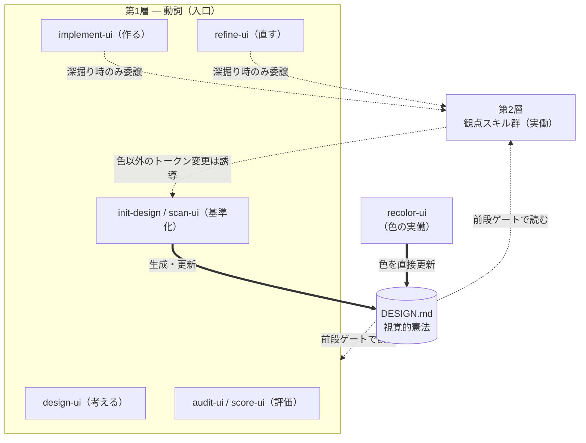
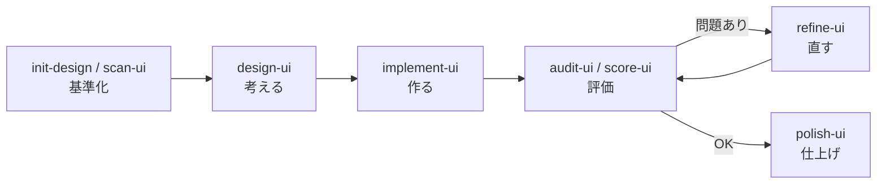

# ui-design-grounding

UI/UX 設計の判断軸と知識ベースを提供する Claude Code プラグイン。

## 概要

AI エージェントが UI/UX の設計・実装・レビューを行う際に、根拠に基づいた判断ができるようナレッジベースとワークフローを提供します。「なんとなく良さそう」ではなく「なぜその判断なのか」を明示するための設計支援ツールです。

## コンセプト

AI エージェントでアプリを実装すると、動くけれど「なんとなくダサい」UI になりがちです。原因は実装力ではなく **デザインの判断軸** の不足。このプラグインは、その判断軸（なぜそうするか）を AI エージェントに与え、**判断を効かせたまま実装・修正まで完遂** させます。

スキルが上乗せするのは次の3つで、その上で実装・修正まで担いきります:

- **判断軸の注入** — 18 件のリファレンスに UI/UX の原則・パターンを集約
- **観点の網羅** — 色・タイポグラフィ・余白・モーション・文言・堅牢性・性能… を漏らさない
- **意図の翻訳** — 「なんかうるさい」のような曖昧な訴えを、具体的なナレッジ適用に変換する

そして中心に置くのが **[DESIGN.md](#designmd--設計の基盤)** — プロジェクトの視覚的アイデンティティをここに固定し、全スキルがそれに沿って動きます。

## インストール

```bash
claude install-plugin nextscape/ui-design-grounding
```

## 使い方

```
/ui-help              ← まずここから。全コマンドをカテゴリ別に表示
/ui-help レイアウト    ← キーワードで絞り込み
```

### 典型的なワークフロー

**新規設計**: `/init-design`（基準）→ `/design-ui`（構造）→ `/implement-ui`（実装）→ `/audit-ui`

**既存UIの改善（観点が曖昧）**: `/refine-ui`（観点ベースで診断→委譲して修正）→ `/audit-ui` or `/score-ui`

**既存UIの改善（観点が明確）**: 該当する第2層スキルを直接実行（例: `/typeset-ui`）

**リリース前**: `/polish-ui` → `/score-ui`

> 評価スキル（`audit-ui`, `score-ui`）は検出した問題を対応スキルへ自動マッピングします。  
> 結果の「推奨アクション」に表示される番号を指定すれば、そのまま修正に入れます。

## スキルの全体像（コマンドスキルの2層）

コマンドスキルは「**第1層＝動詞（何をするか）**」と「**第2層＝観点（どの軸を実際に直すか）**」の2層で構成されます（※後述「構成」の "ナレッジ / コマンド" の二層とは別の軸）。

- **第1層（入口・少数の動詞）**: 考える `design-ui` / 作る `implement-ui` / 直す `refine-ui` / 評価する `audit-ui`・`score-ui` / 基準化する `init-design`・`scan-ui`。まずこの動詞だけ覚えれば十分。
- **第2層（観点・実働ユニット）**: 色・タイポ・レイアウト・モーション・文言・堅牢性・性能などを実際に直すスキル。第1層（`implement` / `refine`）から**深掘り時に委譲され**、軸が明確なら直接も呼べる。



> **配線の読み方**: DESIGN.md が中心。第1層・第2層とも作業前に DESIGN.md を読む（前段ゲート）。`implement`／`refine` は**軽微なら自前で直し、深掘りが要る観点だけ**第2層へ委譲する。DESIGN.md を更新できるのは2系統 — **`init-design`／`scan-ui`（全トークン・人間承認）**と **`recolor-ui`（色・専用）**。第2層が色以外のトークン水準を変えたら `init-design` へ誘導して反映する（自動では書き換えない）。

ライフサイクルで見ると、DESIGN.md を基盤に「基準化 → 考える → 作る → 評価 → 直す → 仕上げ」と巡ります:



## DESIGN.md — 設計の基盤

**DESIGN.md** は「リポジトリの視覚的アイデンティティの憲法」。色・タイポグラフィ・余白・角丸・深度・モーション・コンポーネントの「正解」を1ファイルに集約した単一情報源です。

### なぜ基盤なのか

- **永続する記憶**: スキルは呼んだときだけ効く一過性の記憶。DESIGN.md はファイルとして残り毎回読まれる永続の記憶で、結論を固定でき忘れない。
- **重力の中心**: 第1層スキルは作業前に必ず DESIGN.md を読む（**前段ゲート**）。1つの観点スキルを呼んでも全観点の基準が一度に視野へ入るため、「タイポは直したが色コントラストが壊れた」式の視野狭窄を防ぐ。
- **自動参照**: プロジェクトルートに置くだけで、Claude Code / Cursor / Copilot 等がスキル呼び出し無しでも参照する。デザイン指示を毎回プロンプトに書く必要がなくなる。
- **育つほど効く**: DESIGN.md が充実するほど各スキルは「準拠」で足り、未整備なほど観点スキルが手取り足取りを担う。

### 形式（google-labs-code/design.md 準拠, `version: alpha`）

- **YAML front matter** — 機械可読トークン（`colors` / `typography` / `rounded` / `spacing` / `components`）。primitive → semantic の2層で、`{}` 参照により値の重複を避ける。
- **本文** — 冒頭に **Summary**（全観点の基準を 10〜20 行で一覧する忘却防止層）＋ 8セクションの散文（Overview / Colors / Typography / Layout / Elevation & Depth / Shapes / Components / Do's and Don'ts）。
- **散文 > 精密な値** — 「モダンでクリーン」より「1970年代の大学講義ハンドアウト」のような具体的な参照を重視する。
- **小さく保つ** — 結論のみ・更新型で 150〜250 行が目安。大規模化したらトークンを `tokens.css` / `tokens.json` に外出しする。

### 作る・更新する

- **作る**: `init-design`（既存コード・要件から生成）/ `scan-ui`（外部 URL から逆算）/ `extract-ui`（コードからトークン抽出）。
- **更新する**: 修正系スキルは値の乖離を検出したら誘導するだけ（色 → `recolor-ui` / その他 → `init-design`）。**DESIGN.md を自動では書き換えない** — 憲法の更新は人間の承認のもとで行う。
- **見る**: `preview-ui`（DESIGN.md をほぼ機械的に `preview.html` へ反映してブラウザで視覚確認）。`scan-ui` / `init-design` / `recolor-ui` の提案・更新を、トークンの羅列ではなく実際の見た目で把握できる。

## 構成

```
.claude-plugin/plugin.json    ← プラグインマニフェスト
skills/
  ui-design-grounding/         ← ナレッジベース（コマンドスキルが参照）
    SKILL.md                   ← スタンス・出力ポリシー・参照ナビゲーション
    reference/                 ← 18件のUI/UX原則・仕様リファレンス
  <command-skill>/             ← 23件のコマンドスキル（スラッシュコマンド）
    SKILL.md                   ← ワークフロー定義
```

### ファイル構成の2層（ナレッジ / コマンド）

> ※ これはファイルの構成軸。前述の「第1層 / 第2層（動詞 / 観点）」はコマンドスキル内部の役割軸で、別物。

1. **ナレッジベース** (`skills/ui-design-grounding/`) — 18 件のリファレンス文書に UI/UX 設計の判断基準・原則・パターンを集約
2. **コマンドスキル** (`skills/<name>/`) — 23 件のスラッシュコマンドが構造化されたワークフローを提供し、ナレッジベースを参照

## コマンドスキル一覧

> `/ui-help` でカテゴリ別一覧を会話内に表示できます。

### 第1層 — 動詞（まずここ）

| コマンド | 何をするか | 主な手法・特徴 |
|---------|-----------|---------------|
| `/design-ui` | **考える**：要件からUI構造・画面設計を整理 | UX目的の明文化、画面遷移フロー設計、UI状態マトリックス（初期/ローディング/成功/エラー/空）、情報階層とナビゲーション設計。DESIGN.md は制約として読むが書き換えない（構造に専念） |
| `/implement-ui` | **作る**：観点横断で新規実装まで担う第1層オーケストレーター | DESIGN.md 基準で実装。Atomic Design分解・責務整理・5状態マトリックス・既存資産の再利用判定。深掘りが要る観点だけ第2層へ委譲し、横断波及判定で収束 |
| `/refine-ui` | **直す**：曖昧な訴えを観点ベースで診断→第2層へ委譲 | 「うるさい/読みにくい/ごちゃつく」等を逸脱観点へ翻訳（複数可）。該当する第2層へ委譲して修正まで担い、横断波及判定で収束。診断軸は観点であり「うるささ」ではない |
| `/audit-ui` | **評価（技術）**：5軸で監査 | アクセシビリティ・パフォーマンス・テーミング（トークン準拠率）・レスポンシブ・アンチパターンの各0-4点（合計/20点）。P0-P3重篤度分類。検出問題を対応スキルへ自動マッピング |
| `/score-ui` | **評価（UX）**：ヒューリスティクス評価 | ニールセン10原則で各0-4点（合計/40点）。5種ペルソナ（初回/熟練/a11y/モバイル/ストレス）のレッドフラグテスト。認知負荷アセスメント。検出課題を対応スキルへ自動マッピング |
| `/legibility-ui` | **評価（初見）**：実装を読まず画面だけを見て判断 | 見た目と機能の一致・現在地の把握しやすさ・目的の透明性・スコープ整合・重複表示・画面間一貫性の6レンズで監査。Playwrightで実際に操作し、初見の予想と実際の挙動のギャップを記録。コードは指摘特定後の裏付けとしてのみ参照。検出課題を対応スキルへ自動マッピング |
| `/init-design` | **基準化**：DESIGN.md を生成・更新 | google-labs-code/design.md 仕様（alpha）準拠。YAML front matter（colors/typography/rounded/spacing/components）+ Summary + 8セクション散文。既存CSS/トークンからの自動抽出・スリム化に対応 |
| `/scan-ui` | **基準化（URL）**：外部サイトを分析し DESIGN.md 化 | Playwright で単一ページ／サイト全体の2モード分析。デザインシステムを逆算して DESIGN.md を生成 |
| `/preview-ui` | **見る**：DESIGN.md を preview.html に機械的反映 | front matter トークン＋本文を固定テンプレへ転記。色（primitive ランプ→semantic、on-color コントラスト合否バッジ）・タイポ・余白・角丸・深度・コンポーネント atom の見本帳＋既存トークンだけで組んだ例画面を生成。scan/init/recolor の結果をブラウザで視覚確認 |

### 第2層 — 観点（実働ユニット）

第1層（`implement` / `refine`）から委譲される実働ユニット。軸が明確なら直接呼んでもよい。

#### ビジュアル

| コマンド | 何をするか | 主な手法・特徴 |
|---------|-----------|---------------|
| `/boost-ui` | 印象を強める（地味→大胆） | タイポグラフィ・色・空間・モーション・視覚効果の5軸で個性度を1-5段階評価。1-2軸に集中して増幅。AI slop チェックでテンプレート感を排除。Before/Afterスコア比較 |
| `/calm-ui` | 印象を抑える（派手→洗練） | 色・装飾・タイポ・モーション・レイアウトの5軸で過剰度を1-5診断。60-30-10配色ルール適用、OKLCH彩度調整。「何を残すか」を明示的に選択 |
| `/arrange-ui` | レイアウト・余白・視覚階層を修正 | 4ptベースグリッド、スペーシングリズム（関連密集 vs グループ間開放）、スクイントテスト、光学的調整。カード過剰使用チェック |
| `/typeset-ui` | タイポグラフィを改善 | 5段階モジュラースケール（比率1.25/1.333/1.5）、Fluid Type（`clamp()`）、垂直リズム統一、`max-width: 65ch` 可読性ガイド、OpenType機能活用、FOUT対策（`size-adjust`） |
| `/animate-ui` | モーション・アニメーションを追加 | レイヤードアプローチ（Hero→Feedback→Transition→Delight）、イージングカーブ体系、スタガリングパターン、`prefers-reduced-motion` 必須対応 |
| `/recolor-ui` | 既存 DESIGN.md のパレットを新 primary 中心に OKLCH で再配色 | タイポ・余白・モーションは保持し、セマンティックトークン再割当てとコントラスト再検証を行う。色については自身で DESIGN.md を更新 |

#### コンテンツ

| コマンド | 何をするか | 主な手法・特徴 |
|---------|-----------|---------------|
| `/clarify-ui` | テキスト・ワーディングを改善 | ボタンラベル改善（"OK"→動詞+目的語）、エラーメッセージ3要素（何が→なぜ→どう直す）、用語辞書の作成・一貫性ガード、トーン適応（成功/エラー/破壊的） |

#### 堅牢化・最適化

| コマンド | 何をするか | 主な手法・特徴 |
|---------|-----------|---------------|
| `/guard-ui` | エッジケース・堅牢性を強化 | テキストオーバーフロー処理（`line-clamp`等）、国際化膨張率（独+30%, 中-30%）、CSS論理プロパティ、エッジケース体系チェック（空/ローディング/大量データ/並行操作）、`forced-colors` 対応 |
| `/adapt-ui` | マルチデバイス・レスポンシブ対応 | コンテンツドリブンなブレイクポイント設計、コンテナクエリ（`@container`）、入力方式検出（`pointer: coarse`、`hover: none`）、セーフエリア（`env()`）、タッチターゲット44px基準 |
| `/optimize-ui` | パフォーマンスを最適化 | Core Web Vitals（LCP/INP/CLS）分析、レンダリング性能（メモ化、仮想スクロール）、アニメーション最適化（transform/opacityのみ）、レスポンシブ画像（WebP/AVIF、srcset）、Webフォント最適化 |

#### 整理・抽出

| コマンド | 何をするか | 主な手法・特徴 |
|---------|-----------|---------------|
| `/slim-ui` | UIを本質へ削ぎ落とす | 要素の棚卸しと削減判断基準の明確化。Cowanの限界（同時4項目）、ナビ5つ以下、フォーム4フィールド/グループ。段階的開示（`<details>`等）への変換。認知負荷Before/After比較 |
| `/extract-ui` | コンポーネント・トークンを抽出 | 3回以上出現パターンを抽出基準。Atomic Design粒度判定。Primitive→Semantic→Componentの3階層トークン設計。影響度順（spacing→border→background→text→state）の段階的移行計画 |

#### 仕上げ

| コマンド | 何をするか | 主な手法・特徴 |
|---------|-----------|---------------|
| `/polish-ui` | リリース前の最終チェック＆修正 | 10カテゴリ・50+項目のチェックリスト駆動。インタラクション8状態すべて検証（Default/Hover/Focus/Active/Disabled/Loading/Error/Success）。問題を発見次第その場で修正 |

### ヘルプ

| コマンド | 何をするか | 主な手法・特徴 |
|---------|-----------|---------------|
| `/ui-help` | コマンド一覧を表示 | カテゴリ別のコマンド早見表。「迷ったら」ガイド付き。キーワードで絞り込み可能 |

## リファレンス一覧

| ファイル | カバー領域 |
|---------|-----------|
| `usability.md` | ニールセン10ヒューリスティクス、ペルソナテスト、重篤度分類 |
| `cognitive.md` | 認知負荷、Cowanの限界、違反パターン |
| `information-arch.md` | 情報階層、ナビゲーション設計 |
| `color-system.md` | OKLCH、ダークモード、60-30-10ルール |
| `typography.md` | フォント選定、モジュラースケール、垂直リズム |
| `spatial-layout.md` | 4ptグリッド、視覚階層、コンテナクエリ |
| `interaction.md` | 8インタラクティブ状態、フォーカスリング、Popover API |
| `motion-design.md` | デュレーション体系、イージング、reduced-motion |
| `wording.md` | ボタンラベル、エラーメッセージ、ボイス/トーン |
| `accessibility.md` | WCAG、focus-visible、フォントサイズ |
| `responsive-design.md` | モバイルファースト、ブレイクポイント、入力方式検出 |
| `design-system.md` | コンポーネント設計、Atomic Design、バリアント |
| `design-tokens.md` | Primitive/Semantic/Component トークン、命名 |
| `design-md-spec.md` | DESIGN.md フォーマット仕様・設計思想（front matter／Summary／本文8セクション） |
| `design-md-gate.md` | DESIGN.md ゲート（前段＝基準読込／後段＝乖離検出）の共通プロトコル |
| `implementation.md` | コンポーネント粒度、責務分離、UI状態管理 |
| `anti-patterns.md` | 横断的アンチパターン、AI生成UI品質ゲート |

## 設計方針

- **判断の透明性**: 主観的好みではなく、理由と根拠を伴う提案を行う
- **人間の意思決定を尊重**: 選択肢とトレードオフを提示し、最終判断は人間に委ねる
- **既存資産の尊重**: 既存のコンポーネント・CSS・トークンの再利用を優先する
- **段階的な改善**: 完璧を目指すのではなく、優先度に基づいた改善を支援する

## ライセンス

MIT
