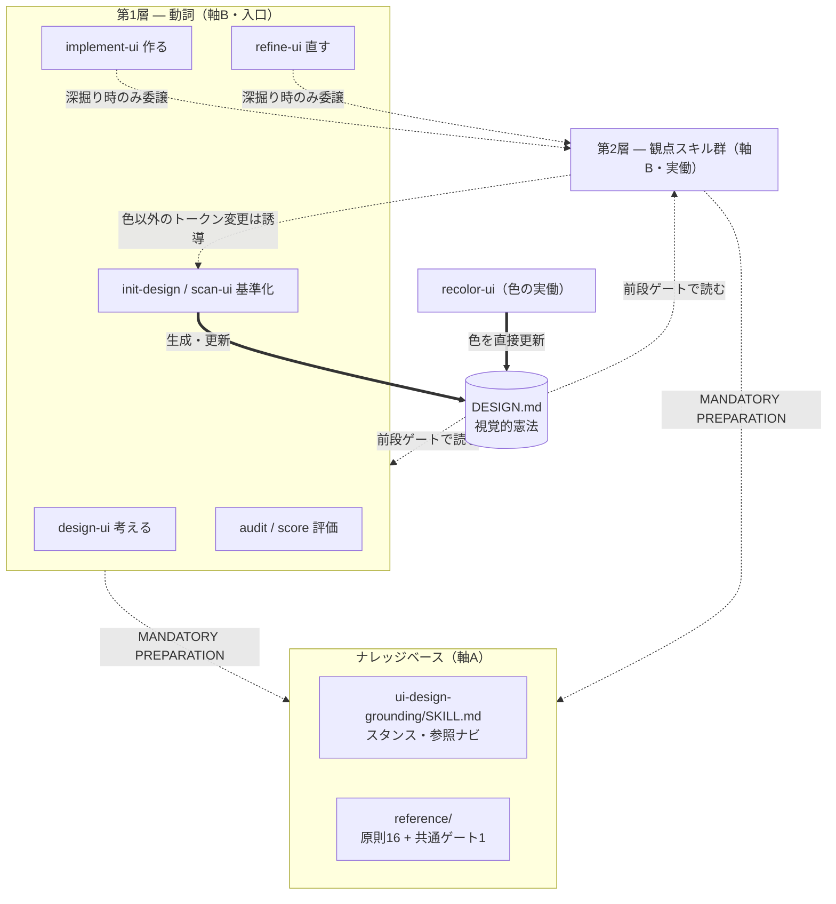
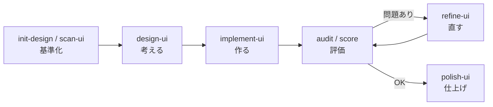

# スキルアーキテクチャ — ui-design-grounding

このプラグインのスキル群が **どう構成され（構成）・各スキルが何を担い（役割）・どう連携し（関係性）・なぜその形なのか（設計意図）** を定義する。
スキルを編集・追加する保守者と貢献者が、全体像と各スキルの位置づけを把握し、安全に変更できる状態を保つことを目的とする。

最終更新: 2026-06-25

---

## 1. 目的とスコープ

### 解く問題

AI エージェントでアプリを実装すると、動くけれど「なんとなくダサい」UI ができる。
原因は実装力の不足ではなく、**デザインの判断軸**（何を良しとするか）の欠落にある。
このプラグインは、その判断軸をエージェントに与え、判断を効かせたまま実装・修正まで完遂させる。

### 責務

- UI/UX 設計の判断基準・原則・パターンを、参照可能なナレッジとして提供する。
- ユーザーの意図（「うるさい」「読みにくい」等の曖昧な訴えを含む）を、具体的なナレッジ適用へ翻訳する入口を提供する。
- 翻訳した判断を効かせて、実装・修正まで担いきる。

### スコープ外

- アプリケーションの実装そのもの。エージェント本来の能力で行い、本プラグインは判断軸を上乗せするにとどまる。
- ビルド・テスト・ランタイムコード。全コンテンツは Markdown で構成され、実行されるコードを持たない。

---

## 2. 設計の中核思想

### スキルが上乗せする3つの価値

実装・修正はエージェントが本来できる。
スキルが上乗せするのは次の3つで、**その判断を効かせて実装・修正まで担いきる**。

1. **判断軸の注入** — 何を良しとするかの基準（＝ナレッジ）。
2. **観点の網羅** — 色・タイポ・余白・モーション・文言・堅牢性・性能… の見落としを防ぐチェックリスト。
3. **意図の翻訳** — 「なんかうるさい」のような曖昧な訴えを、具体的なナレッジ適用に変換する。

すなわちスキル群は「**判断軸を強制し、その判断を効かせて実装・修正まで完遂する、意図ベースのナレッジ・ルーター兼・実働オーケストレーター**」である。

### 2つの記憶

判断軸を「効かせ続ける」には、記憶の持ち方が鍵になる。
本アーキテクチャは2種類の記憶を使い分ける。

- **スキル＝一過性の記憶** — 呼んだときだけ効く。深い分析に向くが、呼ばなければ忘れる。
- **DESIGN.md＝永続の記憶** — ファイルとして残り毎回読まれる。結論を固定でき、忘れない（→ 7 節）。

観点スキルで「学び・分析」し、その結論を DESIGN.md に「固定」する。
これにより、コンテキスト肥大による観点の忘却（視野狭窄）を構造的に防ぐ。
DESIGN.md を全スキルが収束する**重力の中心**に置くことが、この設計の背骨である。

---

## 3. 全体構成：2つの直交する層

このプラグインには、混同しやすい **2つの別々の「層」軸** がある。
両者は直交する別物であり、片方の層を語るときにもう片方を持ち込まない。

| 軸 | 何を分けるか | 区分 |
|---|---|---|
| 軸A：ファイル構成層 | ファイルとしての役割 | ナレッジベース / コマンドスキル |
| 軸B：コマンドスキルの役割層 | コマンドスキル内部の役割 | 第1層（動詞）/ 第2層（観点） |

軸Aはディレクトリ構造（4 節・5/6 節）、軸Bはコマンドスキルの入口設計（5 節・6 節）に対応する。
全体の配線は次のとおり。DESIGN.md が中心にあり、すべてのスキルが作業前にこれを読む。

---

## 4. ナレッジベース（軸A）

ナレッジベース（`skills/ui-design-grounding/`）は、判断基準・原則・パターンを集約した参照層である。
ユーザーが直接呼び出すことはなく、各コマンドスキルが MANDATORY PREPARATION（作業前の必須準備）として参照する。
構成は、ルートスキル 1 件と `reference/` 配下の 17 ファイル（原則・仕様 16 件＋共通ゲート 1 件）。

### ルートスキル（SKILL.md）

判断の **スタンス・出力ポリシー・参照ナビゲーション** を定義する。
「理由と前提を明示する」「断定せず選択肢とトレードオフを示す」「最終判断は人間に委ねる」という、全スキル共通の振る舞いの基準を置く。

### リファレンス（reference/）

UI/UX の各領域を 1 ファイル 1 領域で扱う。
コマンドスキルは、自分の観点に対応するファイルだけを読み込む。

| 領域 | ファイル | カバー範囲 |
|---|---|---|
| ユーザビリティ・認知 | `usability.md` / `cognitive.md` / `information-arch.md` | ニールセン10原則・重篤度分類／認知負荷・Cowanの限界／情報階層・ナビ |
| ビジュアル | `color-system.md` / `typography.md` / `spatial-layout.md` | OKLCH・60-30-10／モジュラースケール・垂直リズム／4ptグリッド・視覚階層 |
| インタラクション・文言 | `interaction.md` / `motion-design.md` / `wording.md` | 8状態・フォーカス／デュレーション・イージング・reduced-motion／ラベル・エラー文言 |
| アクセシビリティ・レスポンシブ | `accessibility.md` / `responsive-design.md` | WCAG・focus-visible／モバイルファースト・入力方式検出 |
| システム・実装 | `design-system.md` / `design-tokens.md` / `implementation.md` | Atomic Design／Primitive/Semantic/Component トークン／責務分離・状態管理 |
| 品質 | `anti-patterns.md` | 横断的アンチパターン、AI 生成 UI 品質ゲート |
| DESIGN.md 関連 | `design-md-spec.md` / `design-md-gate.md` | DESIGN.md のフォーマット仕様（→ 7 節）／共通ゲートのプロトコル（→ 8.1） |

> 末尾2件は性質が異なる。`design-md-spec.md` は DESIGN.md の書式仕様、`design-md-gate.md` は全コマンドスキルが従う連携プロトコルであり、原則リファレンスではない。

---

## 5. コマンドスキル：第1層（動詞・入口）

コマンドスキルは 22 件あり、軸Bで第1層（動詞）と第2層（観点）に分かれる。
第1層は **ユーザーがまず覚える少数の入口** で、5 つの動詞に閉じる。
5 動詞は、ライフサイクル（→ 8.3）の各ノードと一対一で対応する。

| 動詞 | スキル | 役割 |
|---|---|---|
| 考える | `design-ui` | 要件から画面構成・遷移・情報設計・UI 状態を整理する構造設計。DESIGN.md は制約として読むが書き換えない |
| 作る | `implement-ui` | 新規実装を担う第1層オーケストレーター。観点を横断的に通し、深掘りが要る観点だけ第2層へ委譲して実装まで担う |
| 直す | `refine-ui` | 既存修正を担う第1層オーケストレーター。曖昧な訴えを逸脱観点へ翻訳（複数可）し、第2層へ委譲して修正まで担う |
| 評価する | `audit-ui` / `score-ui` | 技術品質5軸の監査（audit）／ニールセン10原則の UX 採点（score）。実装は変更せず、検出問題を対応スキルへマッピングする |
| 基準化する | `init-design` / `scan-ui` | DESIGN.md を生成・更新する。init-design は既存コード・要件から、scan-ui は外部 URL から逆算する |

### オーケストレーターとしての implement / refine

`implement-ui` と `refine-ui` は、**観点スキルを呼び出す薄い実働オーケストレーター**である。
軽微な修正は自前で行い、深掘りが要る観点だけ第2層へ委譲する。
委譲・修正の後に、他観点への波及を判定し（横断波及判定、→ 8.2）、必要なら追加の第2層を呼んで収束させる。

### 補助の入口（第1層に準じる）

5 動詞のライフサイクルには乗らないが、第1層と同じ入口の高さで使う 2 件。

| スキル | 役割 |
|---|---|
| `preview-ui` | DESIGN.md をほぼ機械的に `preview.html` へ変換し、トークンの見た目をブラウザで視覚確認する |
| `ui-help` | 全コマンドをカテゴリ別に一覧し、どのコマンドを使うかのナビを提供する |

---

## 6. コマンドスキル：第2層（観点・実働ユニット）

第2層は、各観点を **実際に直す実働ユニット**である（計 13 件）。
第1層から委譲されるほか、軸を自覚したユーザーは直接も呼べる（二重の入口）。
各観点を独立スキルとして残すのは、一観点＝一責務で修正手順を小さく保ち、保守可能にするため（→ 9・決定1）。

| グループ | スキル | 役割 |
|---|---|---|
| ビジュアル | `boost-ui` / `calm-ui` | 印象を強める（地味→大胆）／抑える（派手→洗練）。主観の「方向」入口 |
| ビジュアル | `arrange-ui` / `typeset-ui` / `animate-ui` | レイアウト・余白・視覚階層／タイポグラフィ／モーション・アニメーションを直す |
| ビジュアル | `recolor-ui` | パレットを新 primary 中心に OKLCH で再配色する。**色については自身で DESIGN.md を更新する**（→ 8.4） |
| コンテンツ | `clarify-ui` | ボタンラベル・エラーメッセージ・用語一貫性などの文言を直す |
| 堅牢化・最適化 | `guard-ui` / `adapt-ui` / `optimize-ui` | エッジケース・i18n の堅牢化／マルチデバイス適応／パフォーマンス最適化 |
| 整理・抽出 | `slim-ui` / `extract-ui` | 本質へ削ぎ落とす／コンポーネント・トークンを抽出する |
| 仕上げ | `polish-ui` | リリース前のチェックリスト駆動で、発見した問題をその場で修正する |

> `extract-ui` は第2層の実働ユニットであると同時に、コードからトークンを抽出して DESIGN.md の素材を生む **生成側**でもある（→ 8.1 ゲート区分で `init-design` / `scan-ui` と同列に扱う）。

---

## 7. DESIGN.md — 設計の基盤

DESIGN.md は「リポジトリの視覚的アイデンティティの憲法」であり、色・タイポ・余白・角丸・深度・モーション・コンポーネントの「正解」を 1 ファイルに集約した単一情報源（source of truth）である。
プロジェクトルートに置くだけで、Claude Code / Cursor / Copilot 等がスキル呼び出し無しでも参照する。

### 役割（なぜ基盤なのか）

- **永続の記憶** — 一過性のスキルと違い、毎回読まれて結論を固定する（→ 2 節）。
- **視野狭窄の防止** — 1 観点スキルを呼んでも、前段ゲートで全観点の基準が一度コンテキストに載る。
- **育つほど効く** — DESIGN.md が充実するほど各スキルは「準拠」で足り、未整備なほど観点スキルが手取り足取りを担う。
- **コンテキストの節約** — DESIGN.md が無いと観点を効かせるたびに reference を読む。あれば濃縮済みの結論を読むだけで済み、観点スキルを呼ぶ頻度自体が減る。

### 形式（google-labs-code/design.md 準拠, `version: alpha`）

- **YAML front matter** — 機械可読トークン（`colors` / `typography` / `rounded` / `spacing` / `components`）。primitive → semantic の2層で、`{}` 参照により値の重複を避ける。
- **本文** — 冒頭に **Summary**（全観点の基準を 10〜20 行で一覧する忘却防止層）＋ 8 セクションの散文。
- **小さく保つ** — 結論のみ・更新型で 150〜250 行が目安。理由・汎用論は書かず reference/ に委ねる。大規模化したらトークンを `tokens.css` / `tokens.json` に外出しする（→ 9・決定4）。

### 生成・更新・閲覧の担い手

| 操作 | 担うスキル | 補足 |
|---|---|---|
| 生成 | `init-design`（コード・要件）/ `scan-ui`（URL）/ `extract-ui`（トークン抽出） | — |
| 更新 | `init-design` / `scan-ui`（全トークン）/ `recolor-ui`（色のみ） | 憲法の更新は人間の承認のもとで行う。自動では書き換えない |
| 閲覧 | `preview-ui` | トークンの羅列でなく実際の見た目で把握する |

---

## 8. スキル間の連携

### 8.1 DESIGN.md ゲート（共通プロトコル）

全コマンドスキルが DESIGN.md を必ず通るための共通プロトコル（`design-md-gate.md`）。
双方向の乖離 ——「DESIGN.md があるのに参照せず実装する」「修正で値を変えたのに DESIGN.md が取り残される」—— を防ぐ。
ゲートは2種類あり、**持ち方は層で変わる**。

- **前段ゲート（基準の読み込み）** — 手順の最初に DESIGN.md を読み、reference より優先する基準として扱う。既存トークンで表現できる変更は新しい値を持ち込まない。
- **後段ゲート（乖離の検出と誘導）** — 修正後に、変更したトークン・規約を列挙し、反映先（色→`recolor-ui` / それ以外→`init-design`）へ誘導する。自動では書き換えない。

| 区分 | スキル | 前段 | 後段 |
|---|---|:---:|:---:|
| 第1層（考える/作る/直す/評価） | `design-ui` `implement-ui` `refine-ui` `audit-ui` `score-ui` | ✓ | —（値の最終確定・乖離検出は委譲先が担う） |
| 第2層（実働） | `boost` `calm` `typeset` `animate` `arrange` `slim` `clarify` `guard` `adapt` `optimize` | ✓ | ✓ |
| 配色（実働） | `recolor-ui` | ✓ | ✓（色は自身で DESIGN.md を更新） |
| 仕上げ（実働） | `polish-ui` | ✓ | ✓ |
| 生成側 | `init-design` `scan-ui` `extract-ui` | — | —（DESIGN.md そのものを生成・更新する側） |

> 後段（乖離検出）は **値を実際に動かす実働層にのみ**置く。第1層オーケストレーターは前段のみを持ち、二重の乖離検出を避ける。

### 8.2 委譲と横断波及判定（二層の波及チェック）

第1層オーケストレーター（`implement` / `refine`）が第2層へ委譲し、観点を横断する。
修正が他観点を壊していないかの波及チェックは、入口によって深さが変わる**二層**で持つ。

- **第2層（実働）＝最小の自己チェック** — 自分の修正が DESIGN.md の他トークン水準を壊していないか（例：タイポ変更→行長・垂直リズム、色変更→コントラスト）。直接呼びの安全網。
- **第1層オーケストレーター＝横断の波及判定** — 委譲・修正後に他観点への波及を判定し、必要なら追加で別の第2層を呼ぶ。

### 8.3 ライフサイクル

5 動詞は、DESIGN.md を基盤に「基準化 → 考える → 作る → 評価 → 直す → 仕上げ」と巡る。
DESIGN.md が育つほど各スキルは準拠で足り、未熟なほど観点・方向スキルが手取り足取りを担う。

### 8.4 DESIGN.md の更新経路

DESIGN.md を書き換えられるのは限られた経路だけで、それ以外は誘導にとどめる。

- **全トークンの更新** — `init-design` / `scan-ui`。人間の承認のもとで行う。
- **色の更新** — `recolor-ui` のみ、自身で完結して更新する。
- **第2層が色以外のトークン水準を変えた場合** — 後段ゲートで乖離を明示し、`init-design` へ誘導する（自動では書き換えない）。

---

## 9. 設計判断（ADR）

この構成に至った主要な決定を、決定・背景・代替案・結果で凝縮して残す。
詳細な検討経緯は本節の各項に集約し、後から参加する人と未来の自分が安全に変更できる根拠とする。

### 決定1：観点スキルを残す（統合しない）

- **背景** — 観点スキルが多く「分割しすぎ」に見える。
- **代替案** — (A) 実行2軸に集約し観点はナレッジへ降格／(B) 観点グループに中間集約／(C) 観点スキルを残す。
- **決定／結果** — C。各観点は独立した実働ユニットであり、一観点＝一責務で保守を小さく保てる（`refine-ui` に全観点を詰めると巨大化し保守不能）。軸を自覚したユーザーの直接入口にもなり、オーケストレーターの委譲先にもなる。

### 決定2：欠けていたのは観点でなく「実行軸」＝2層化

- **背景** — 旧20スキルは実行軸（動詞）と観点軸（レンズ）を1平面に潰していた。結果、新規実装の入口が無く、観点横断に複数スキルを個別に呼ぶ必要があった。
- **決定／結果** — 入口を2層に再編した。第1層＝少数の動詞、第2層＝観点の実働ユニット。`implement` / `refine` を薄い実働オーケストレーターとし、計画で止めず実装・修正まで担う。

### 決定3：design-ui を第1層「考える」へ格上げ（init-design と直交）

- **背景** — `design-ui`（構造設計）と `init-design`（視覚的憲法の定義）は "設計" の語を共有するが、直交する別レイヤー。構造設計は DESIGN.md を書く行為ではない。
- **決定／結果** — 両者は統合しない。読者はアプリエンジニアで、最も効くのは「コードを書く前に構造をデザイン観点で考える」瞬間。これを独立した動詞として持たせ、第1層を5動詞に閉じた。`design-ui` は DESIGN.md を制約として読むが書き換えない。

### 決定4：忘却対策＝DESIGN.md の常駐化

- **背景** — 観点スキルは自分の観点の reference しか読まないため、「タイポは直したが色コントラストが壊れた」式の視野狭窄が、コンテキスト肥大で構造的に起きる。
- **決定／結果** — 観点スキルで学び・分析し、結論を DESIGN.md に固定する。前段ゲートで全観点の基準が一度コンテキストに載るため視野狭窄を防ぐ。波及チェックは二層（→ 8.2）で補強する。DESIGN.md の整備促進と書き戻しが忘却対策の本丸。

### 決定5：DESIGN.md は「結論だけ・2階建て・更新型」で肥大を防ぐ

- **背景** — 全観点の常駐記憶にすると肥大化が懸念される。
- **決定／結果** — 結論のみ記す（理由は reference/ へ）／冒頭サマリ層＋詳細層の2階建て／追記でなく更新（上書き・統合）／大規模化したらトークンを外出し／重複は `init-design` がスリム化。「大きくなった」は情報量でなく冗長の問題として扱う。

---

## 10. 用語集

| 用語 | 定義 |
|---|---|
| DESIGN.md | リポジトリの視覚的アイデンティティの憲法。トークンと指針を集約した単一情報源・永続の記憶（→ 7 節） |
| ナレッジベース | 判断基準・原則を集約した参照層（`skills/ui-design-grounding/`）。コマンドスキルが参照する（軸A） |
| コマンドスキル | ユーザーが呼ぶスラッシュコマンド（計22件）。第1層・第2層に分かれる（軸B） |
| 第1層（動詞） | ユーザーがまず覚える少数の入口。考える・作る・直す・評価する・基準化する の5動詞 |
| 第2層（観点） | 各観点を実際に直す実働ユニット（計13件）。委譲・直接呼びの両入口を持つ |
| 観点 | 色・タイポ・レイアウト・モーション・文言・堅牢性・性能… の修正のレンズ |
| 実働ユニット | 分析だけで終わらず、その観点を実際に修正まで担うスキル |
| オーケストレーター | 観点スキルを呼び分けて横断的に通す第1層スキル（`implement` / `refine`） |
| 前段ゲート | 作業前に DESIGN.md を読み、基準として扱う手順 |
| 後段ゲート | 修正後に DESIGN.md との乖離を検出し、反映先へ誘導する手順 |
| 横断波及判定 | 修正が他観点へ波及していないかをオーケストレーターが判定し、必要なら追加委譲する仕組み |
| MANDATORY PREPARATION | 各コマンドスキルが作業前に必須で行う、ナレッジベース参照などの準備手順 |
